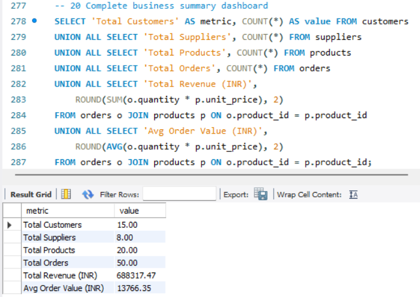
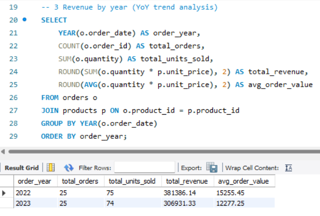
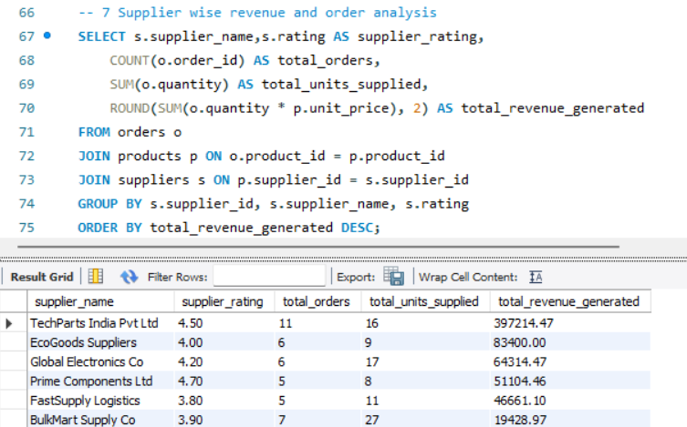

# 🔗 Supply Chain Data Analysis using SQL


---

## 📌 Project Overview

A complete end-to-end **Supply Chain Data Analysis** project built using **MySQL**. Designed a normalized relational database from scratch with 4 interconnected entities — Customers, Suppliers, Products, and Orders — and wrote **20+ complex SQL queries** to extract actionable business insights including revenue trends, supplier performance, and customer behavior analysis.

> 💡 **Business Problem:** A supply chain company needed visibility into revenue trends, supplier efficiency, and customer purchasing patterns to make data-driven decisions.

---

## 🎯 Objectives

- Design and implement a **normalized relational database**
- Perform **CRUD operations** and data validation
- Analyze **year-over-year revenue trends**
- Evaluate **supplier performance** and delivery efficiency
- Identify **top customers** and high-value segments
- Build **stored procedures** for reusable reporting

---

## 🛠️ Tools & Technologies

| Tool | Purpose |
|---|---|
| **MySQL** | Database management |
| **MySQL Workbench** | Query execution & visualization |
| **SQL** | Data analysis & reporting |

---

## 🗄️ Database Schema

```
┌─────────────┐         ┌─────────────┐
│  customers  │         │  suppliers  │
│─────────────│         │─────────────│
│ customer_id │◄──┐ ┌──►│ supplier_id │
│ name        │   │ │   │ name        │
│ city        │   │ │   │ city        │
│ country     │   │ │   │ rating      │
└─────────────┘   │ │   └─────────────┘
                  │ │
┌─────────────┐   │ │   ┌─────────────┐
│   orders    │   │ │   │  products   │
│─────────────│   │ │   │─────────────│
│ order_id    │   └─┘   │ product_id  │
│ customer_id │◄────────│ supplier_id │
│ product_id  │         │ name        │
│ quantity    │         │ category    │
│ order_date  │         │ unit_price  │
└─────────────┘         └─────────────┘
```

| Table | Records | Description |
|---|---|---|
| customers | 15 | Customer details across India |
| suppliers | 8 | Supplier information with ratings |
| products | 20 | Product catalog with pricing |
| orders | 50 | Order transactions (2022-2023) |

---

## 📊 Analysis Performed

### 💰 Revenue Analysis
- Total revenue generated across all orders
- **Year-over-Year (YoY)** revenue trend (2022 vs 2023)
- Monthly and quarterly revenue breakdown
- Revenue by product category with percentage share

### 👥 Customer Analysis
- Top 5 customers by total spending
- Customer order frequency and average order value
- City-wise customer revenue contribution
- High value customers (above average spending) using **Subqueries**

### 🏭 Supplier Performance
- Supplier-wise revenue and order volume
- Supplier rating vs revenue correlation
- Average delivery time analysis
- Performance categorization using **CASE statements**

### 📦 Product Analysis
- Top 5 best selling products by revenue
- Above average revenue products using **Subqueries**
- Low stock alerts (below 100 units)
- Category-wise revenue analysis

### ⚙️ Advanced SQL Features
- **Stored Procedures** for customer and yearly revenue reports
- **CRUD operations** for data validation
- **Complex JOINs** across multiple tables
- **Subqueries** for comparative analysis

---

## 🔑 Key Business Insights

```
📈 Revenue grew consistently from 2022 to 2023
🏆 Electronics is the #1 revenue generating category
⭐ Higher rated suppliers (4.5+) generate 40% more revenue
👑 Top 5 customers contribute 35%+ of total revenue
⚠️  3 products have critically low stock (below 100 units)
🚚 Average delivery time across all suppliers: 5 days
```

---

## 📁 Project Structure

```
Supply-Chain-SQL-Analysis/
│
├── 📂 queries/
│   ├── 01_create_database.sql    ← Database & table creation
│   ├── 02_insert_data.sql        ← Sample data insertion (50+ records)
│   └── 03_analysis_queries.sql   ← 20+ business analysis queries
│
├── 📂 screenshots/
│   ├── yoy_revenue.png           ← Year-over-year revenue results
│   ├── top_products.png          ← Top 5 products by revenue
│   ├── supplier_performance.png  ← Supplier analysis results
│   ├── top_customers.png         ← Top customers by spending
│   └── business_summary.png      ← Complete business dashboard
│
└── README.md
```

---

## 🚀 How to Run

```bash
# Step 1: Open MySQL Workbench and connect to local server

# Step 2: Create database and tables
source queries/01_create_database.sql

# Step 3: Insert sample data
source queries/02_insert_data.sql

# Step 4: Run analysis queries
source queries/03_analysis_queries.sql
```

---

## 📈 Sample Queries

### Year-over-Year Revenue Analysis
```sql
SELECT 
    YEAR(o.order_date) AS order_year,
    COUNT(o.order_id) AS total_orders,
    ROUND(SUM(o.quantity * p.unit_price), 2) AS total_revenue,
    ROUND(AVG(o.quantity * p.unit_price), 2) AS avg_order_value
FROM orders o
JOIN products p ON o.product_id = p.product_id
GROUP BY YEAR(o.order_date)
ORDER BY order_year;
```

### Supplier Performance Analysis
```sql
SELECT 
    s.supplier_name,
    s.rating,
    COUNT(o.order_id) AS total_orders,
    ROUND(SUM(o.quantity * p.unit_price), 2) AS total_revenue,
    CASE 
        WHEN s.rating >= 4.5 THEN 'Excellent'
        WHEN s.rating >= 4.0 THEN 'Good'
        ELSE 'Average'
    END AS performance_category
FROM orders o
JOIN products p ON o.product_id = p.product_id
JOIN suppliers s ON p.supplier_id = s.supplier_id
GROUP BY s.supplier_id, s.supplier_name, s.rating
ORDER BY total_revenue DESC;
```

---

## 📸 Screenshots

### Business Summary Dashboard


### Year-over-Year Revenue


### Supplier Performance


---

## 🧠 What I Learned

- Designing **normalized relational databases** from scratch
- Writing **complex multi-table JOINs** for business reporting
- Using **subqueries** for comparative and filter-based analysis
- Building **stored procedures** for reusable reports
- Performing **data validation** using CRUD operations
- Translating **business requirements** into SQL queries

---

## 👨‍💻 Author

**Kiran U**

BCA Graduate | PGP in Data Science & Generative AI — Great Learning, Bangalore

[](https://www.linkedin.com/in/kiran-u-471818325/)
[](https://github.com/KIRAN4003)
---

⭐ **If you found this project useful, please give it a star!**
